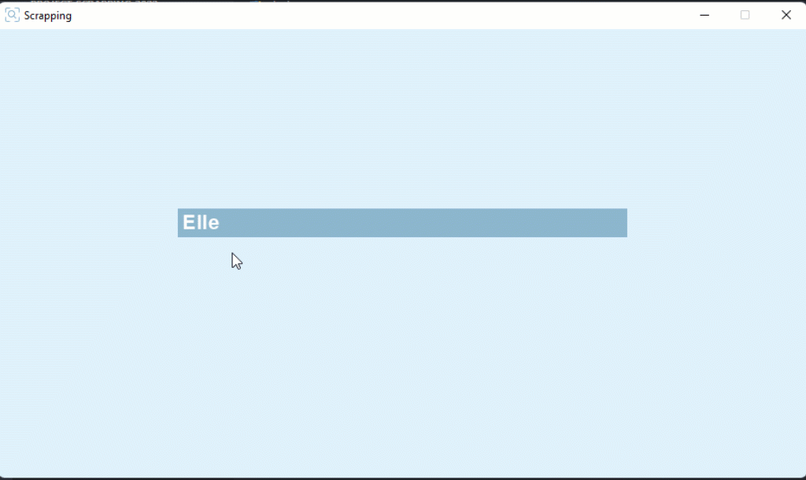

# Nim game
> Search a music and see the lyrics

  

> Dowload the music

  

## 🚀 What is my project ?
Scrapping project that allows you to search the lyrics of a music as well as download it as well as browse it to make a stat graph with the lexical fields.

## 💻 Python library to install :

* googlesearch `pip install googlesearch-python`
* bs4 `pip install bs4`
* pyttsx3 `pip install pyttsx3`
* youtube_dl `pip install youtube_dl`
* lxml `pip install lxml`

## :mailbox: Contact me :

<a href="https://instagram.com/matth_gdl/">&nbsp;&nbsp;&nbsp;&nbsp;&nbsp;&nbsp;&nbsp;&nbsp;</a>

📧 Mail : matthieu.gaudel04@gmail.com
